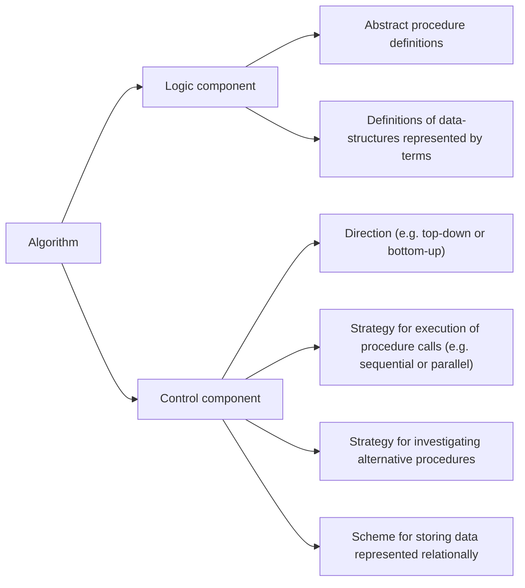

An algorithm can be regarded as consisting of a logic component and a control component.

# Logic Component
The logic component specifies the knowledge to be used in solving problems.

The definition of factorial constitutes the logic component of the algorithms:\
1 is the factorial of 0;\
u is the factorial of x + 1 if v is the factorial of x and u is v times x + 1.

# Control Component
The control component determines the problem-solving strategies by means of which that knowledge is used.

With the definition of factorial, it can be used bottom-up to derive a sequence of assertions about factorial or it can be used top-down to reduce the problem of computing the factorial of x + 1 to the subproblems of computing the factorial of x and multiplying the result by x + 1.

In top-down problem-solving, we reason backwards from the conclusion, repeatedly reducing goals to subgoals until eventually all subgoals are solved directly by the original assertions. In bottom-up problem-solving, we reason forwards from the hypotheses, repeatedly deriving new assertions from old ones until eventually the original goal is solved directly by derived assertions.

Different ways of using the same definition give rise to different algorithms. Bottom-up use of the definition behaves like iteration. Top-down use behaves like recursive evaluation.

# Summary

Computer programs will be more often correct, more easily improved, and more readily adapted to new problems when programming languages separate logic and control.

The efficiency of an algorithm can often be improved
by improving the efficiency of the control component without changing the logic and therefore without changing the meaning of the algorithm.

# Reference
[Algorithm = Logic + Control](https://www.doc.ic.ac.uk/~rak/papers/algorithm%20=%20logic%20+%20control.pdf)